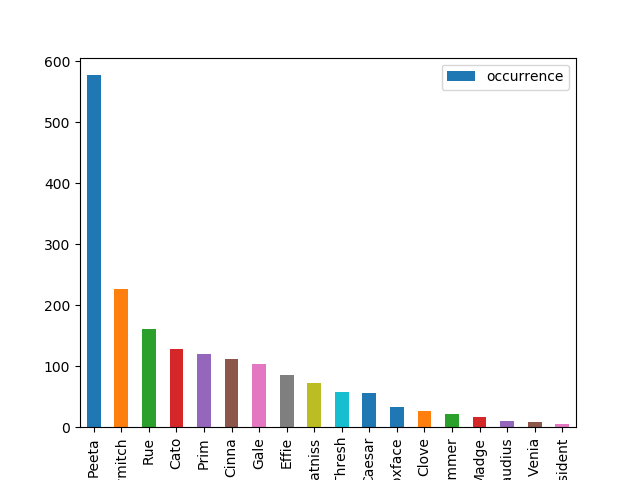

I am a fan of *The Hunger Games*, and I have read all the three books. The story of *The Hunger Games* is narrated by the young girl, Katniss Everdeen. There are many characters in the story, and what I am going to do is to describe the connections between the characters from a data science perspective.

The data is the text of the *The Hunger Games I*, which is the first edition. My steps are listed as followings.

# Preprocessing
I use the nltk package, which is a natural language toolkit, to split the text into token sequence. Then, I count the occurrence of main characters.

