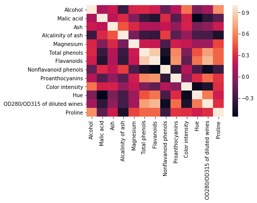
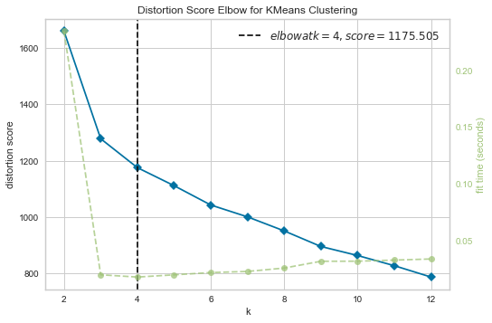
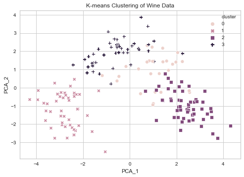

```python
import numpy as np
from scipy import stats
import pandas as pd
import matplotlib.pyplot as plt
import seaborn as sns
from sklearn.cluster import KMeans
from sklearn.decomposition import PCA
from yellowbrick.cluster import KElbowVisualizer
```


```python
col_names = [
"Class",
"Alcohol",
"Malic acid",
"Ash",
"Alcalinity of ash",
"Magnesium",
"Total phenols",
"Flavanoids",
"Nonflavanoid phenols",
"Proanthocyanins",
"Color intensity",
"Hue",
"OD280/OD315 of diluted wines",
"Proline"]


df = pd.read_csv("wine.data", names=col_names)
```


```python
df.head()
```


<div>
<style scoped>
    .dataframe tbody tr th:only-of-type {
        vertical-align: middle;
    }

    .dataframe tbody tr th {
        vertical-align: top;
    }

    .dataframe thead th {
        text-align: right;
    }
</style>
<table border="1" class="dataframe">
  <thead>
    <tr style="text-align: right;">
      <th></th>
      <th>Class</th>
      <th>Alcohol</th>
      <th>Malic acid</th>
      <th>Ash</th>
      <th>Alcalinity of ash</th>
      <th>Magnesium</th>
      <th>Total phenols</th>
      <th>Flavanoids</th>
      <th>Nonflavanoid phenols</th>
      <th>Proanthocyanins</th>
      <th>Color intensity</th>
      <th>Hue</th>
      <th>OD280/OD315 of diluted wines</th>
      <th>Proline</th>
    </tr>
  </thead>
  <tbody>
    <tr>
      <th>0</th>
      <td>1</td>
      <td>14.23</td>
      <td>1.71</td>
      <td>2.43</td>
      <td>15.6</td>
      <td>127</td>
      <td>2.80</td>
      <td>3.06</td>
      <td>0.28</td>
      <td>2.29</td>
      <td>5.64</td>
      <td>1.04</td>
      <td>3.92</td>
      <td>1065</td>
    </tr>
    <tr>
      <th>1</th>
      <td>1</td>
      <td>13.20</td>
      <td>1.78</td>
      <td>2.14</td>
      <td>11.2</td>
      <td>100</td>
      <td>2.65</td>
      <td>2.76</td>
      <td>0.26</td>
      <td>1.28</td>
      <td>4.38</td>
      <td>1.05</td>
      <td>3.40</td>
      <td>1050</td>
    </tr>
    <tr>
      <th>2</th>
      <td>1</td>
      <td>13.16</td>
      <td>2.36</td>
      <td>2.67</td>
      <td>18.6</td>
      <td>101</td>
      <td>2.80</td>
      <td>3.24</td>
      <td>0.30</td>
      <td>2.81</td>
      <td>5.68</td>
      <td>1.03</td>
      <td>3.17</td>
      <td>1185</td>
    </tr>
    <tr>
      <th>3</th>
      <td>1</td>
      <td>14.37</td>
      <td>1.95</td>
      <td>2.50</td>
      <td>16.8</td>
      <td>113</td>
      <td>3.85</td>
      <td>3.49</td>
      <td>0.24</td>
      <td>2.18</td>
      <td>7.80</td>
      <td>0.86</td>
      <td>3.45</td>
      <td>1480</td>
    </tr>
    <tr>
      <th>4</th>
      <td>1</td>
      <td>13.24</td>
      <td>2.59</td>
      <td>2.87</td>
      <td>21.0</td>
      <td>118</td>
      <td>2.80</td>
      <td>2.69</td>
      <td>0.39</td>
      <td>1.82</td>
      <td>4.32</td>
      <td>1.04</td>
      <td>2.93</td>
      <td>735</td>
    </tr>
  </tbody>
</table>
</div>


```python
df.shape
```


    (178, 14)


```python
sns.heatmap(df.iloc[:, 1:14].corr())
```


    <matplotlib.axes._subplots.AxesSubplot at 0x24ea9e3a320>





```python
df.iloc[:, 1:14] = stats.zscore(df.iloc[:, 1:14])
```


```python
df.head()
```


<div>
<style scoped>
    .dataframe tbody tr th:only-of-type {
        vertical-align: middle;
    }

    .dataframe tbody tr th {
        vertical-align: top;
    }

    .dataframe thead th {
        text-align: right;
    }
</style>
<table border="1" class="dataframe">
  <thead>
    <tr style="text-align: right;">
      <th></th>
      <th>Class</th>
      <th>Alcohol</th>
      <th>Malic acid</th>
      <th>Ash</th>
      <th>Alcalinity of ash</th>
      <th>Magnesium</th>
      <th>Total phenols</th>
      <th>Flavanoids</th>
      <th>Nonflavanoid phenols</th>
      <th>Proanthocyanins</th>
      <th>Color intensity</th>
      <th>Hue</th>
      <th>OD280/OD315 of diluted wines</th>
      <th>Proline</th>
    </tr>
  </thead>
  <tbody>
    <tr>
      <th>0</th>
      <td>1</td>
      <td>1.518613</td>
      <td>-0.562250</td>
      <td>0.232053</td>
      <td>-1.169593</td>
      <td>1.913905</td>
      <td>0.808997</td>
      <td>1.034819</td>
      <td>-0.659563</td>
      <td>1.224884</td>
      <td>0.251717</td>
      <td>0.362177</td>
      <td>1.847920</td>
      <td>1.013009</td>
    </tr>
    <tr>
      <th>1</th>
      <td>1</td>
      <td>0.246290</td>
      <td>-0.499413</td>
      <td>-0.827996</td>
      <td>-2.490847</td>
      <td>0.018145</td>
      <td>0.568648</td>
      <td>0.733629</td>
      <td>-0.820719</td>
      <td>-0.544721</td>
      <td>-0.293321</td>
      <td>0.406051</td>
      <td>1.113449</td>
      <td>0.965242</td>
    </tr>
    <tr>
      <th>2</th>
      <td>1</td>
      <td>0.196879</td>
      <td>0.021231</td>
      <td>1.109334</td>
      <td>-0.268738</td>
      <td>0.088358</td>
      <td>0.808997</td>
      <td>1.215533</td>
      <td>-0.498407</td>
      <td>2.135968</td>
      <td>0.269020</td>
      <td>0.318304</td>
      <td>0.788587</td>
      <td>1.395148</td>
    </tr>
    <tr>
      <th>3</th>
      <td>1</td>
      <td>1.691550</td>
      <td>-0.346811</td>
      <td>0.487926</td>
      <td>-0.809251</td>
      <td>0.930918</td>
      <td>2.491446</td>
      <td>1.466525</td>
      <td>-0.981875</td>
      <td>1.032155</td>
      <td>1.186068</td>
      <td>-0.427544</td>
      <td>1.184071</td>
      <td>2.334574</td>
    </tr>
    <tr>
      <th>4</th>
      <td>1</td>
      <td>0.295700</td>
      <td>0.227694</td>
      <td>1.840403</td>
      <td>0.451946</td>
      <td>1.281985</td>
      <td>0.808997</td>
      <td>0.663351</td>
      <td>0.226796</td>
      <td>0.401404</td>
      <td>-0.319276</td>
      <td>0.362177</td>
      <td>0.449601</td>
      <td>-0.037874</td>
    </tr>
  </tbody>
</table>
</div>


```python
model = KMeans()
visualizer = KElbowVisualizer(model, k=(2, 12 + 1))

X = df.iloc[:, 1:14].values

visualizer.fit(X)
visualizer.show()
```





    <matplotlib.axes._subplots.AxesSubplot at 0x24eac197c50>


```python
model = KMeans(n_clusters=4)
model.fit(X)
```


    KMeans(algorithm='auto', copy_x=True, init='k-means++', max_iter=300,
        n_clusters=4, n_init=10, n_jobs=None, precompute_distances='auto',
        random_state=None, tol=0.0001, verbose=0)


```python
pca = PCA(n_components=2)
pca.fit(X)
```


    PCA(copy=True, iterated_power='auto', n_components=2, random_state=None,
      svd_solver='auto', tol=0.0, whiten=False)


```python
print(pca.explained_variance_ratio_)
```

    [0.36198848 0.1920749 ]
    


```python
pca_X = pca.fit_transform(X)
```


```python
pca_X.shape
```


    (178, 2)


```python
df_pca = pd.DataFrame(np.concatenate([pca_X, model.labels_.reshape(-1, 1)], axis=1),
                    columns=["PCA_1", "PCA_2", "cluster"])
df_pca["cluster"] = df_pca["cluster"].astype(np.int32)
df_pca.head()
```


<div>
<style scoped>
    .dataframe tbody tr th:only-of-type {
        vertical-align: middle;
    }

    .dataframe tbody tr th {
        vertical-align: top;
    }

    .dataframe thead th {
        text-align: right;
    }
</style>
<table border="1" class="dataframe">
  <thead>
    <tr style="text-align: right;">
      <th></th>
      <th>PCA_1</th>
      <th>PCA_2</th>
      <th>cluster</th>
    </tr>
  </thead>
  <tbody>
    <tr>
      <th>0</th>
      <td>3.316751</td>
      <td>-1.443463</td>
      <td>2</td>
    </tr>
    <tr>
      <th>1</th>
      <td>2.209465</td>
      <td>0.333393</td>
      <td>2</td>
    </tr>
    <tr>
      <th>2</th>
      <td>2.516740</td>
      <td>-1.031151</td>
      <td>2</td>
    </tr>
    <tr>
      <th>3</th>
      <td>3.757066</td>
      <td>-2.756372</td>
      <td>2</td>
    </tr>
    <tr>
      <th>4</th>
      <td>1.008908</td>
      <td>-0.869831</td>
      <td>0</td>
    </tr>
  </tbody>
</table>
</div>


```python
sns.scatterplot(x="PCA_1", y="PCA_2", hue="cluster", style="cluster", data=df_pca)
plt.xlabel("PCA_1")
plt.ylabel("PCA_2")
plt.title("K-means Clustering of Wine Data")
plt.show()
```




