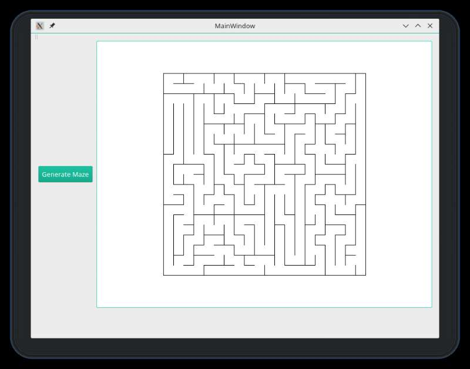

Welcome to my website!

I am Yanjie He, a Data Scientist who is interested in computer science, statistics, and economics. Currently, I am a graduate student studying Data Analytics at the George Washington University. Click <a href="https://yanjiehe.github.io/pages/about.html">here</a> for more information about me.

You can find me in these places:
<ul>
  <li><a href="https://github.com/yanjiehe">GitHub</a></li>
  <li><a href="https://www.kaggle.com/yanjiehe">Kaggle</a></li>
  <li><a href="https://www.linkedin.com/in/yanjiehe/">LinkedIn</a></li>
</ul>

This is my <a href="{{ BASE_PATH }}/assets/resume.pdf">resume</a>.

Here are some of my projects. If you are interested in them, you may click the figures. For more projects, you may check out the <a href="{{ BASE_PATH }}/pages/projects.html">Projects</a> section.

For detailed information about me, you can take a look at <a href="{{ BASE_PATH }}/pages/profile.html">my profile</a>.

<table class="wide">
<tr>
  <td class="left">
    
  </td>
  <td class="right">
    
  </td>
</tr>

<tr>
  <td class="left">
    
  </td>
  <td class="right">
    
  </td>
</tr>

</table>

 

Copyright @ 2018 Yanjie He
