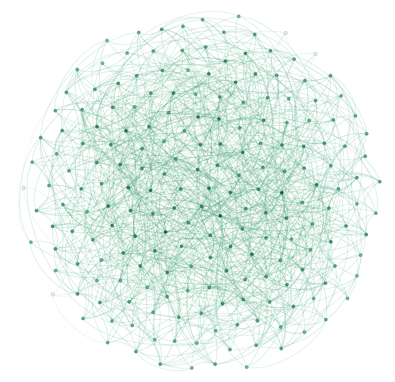

<!--

  

      <ul class="nav">
          <li><a href="{{ BASE_PATH }}/assets/broman_cv.pdf">cv</a></li>
          <li><a href="https://github.com/yanjiehe">github</a></li>
          <li><a href="http://kbroman.org/blog">blog</a></li>
          <li><a href="https://www.linkedin.com/in/yanjie-he-1305a815a/">LinkedIn</a></li>
      </ul>
  

-->

<!--

-->

<!--

Welcome to my website! I am Yanjie He, a Data Scientist who is interested in computer science, statistics and economics.

Currently, I am studying at the Data Analytics program in the George Washington University.

I love travel. And I enjoy commnuicating with people from different cultures.

My dream is to utilize big data to create a better world for everyone.

-->

<table class="wide">
<tr>
  <td class="left">
    

    Welcome to my website! I am Yanjie He, a Data Scientist who is interested in computer science, statistics and economics.
    

    
    

    Currently, I am studying at the Data Analytics program in the George Washington University.
    

    
    

    I love travel. And I enjoy commnuicating with people from different cultures.
    

    
    

    My dream is to utilize big data to create a better world for everyone.
    

  </td>
  <td class="right">
    
  </td>
</tr>
</table>

<!--
### Portfolio

<table class="wide">
<tr>
  <td class="left">
    
  </td>
  <td class="right">
    
  </td>
</tr>
<tr>
  <td class="left">
    
  </td>
  <td class="right">
    
  </td>
</tr>
</table>

  

      <ul class="nav">
          <li><a href="morefigs.html">see more figures</a></li>
      </ul>
  

-->

cv|github|blog|LinkedIn

<!--

  

      <ul class="nav">
          <li><a href="{{ BASE_PATH }}/assets/broman_cv.pdf">cv</a></li>
          <li><a href="https://github.com/yanjiehe">github</a></li>
          <li><a href="http://kbroman.org/blog">blog</a></li>
          <li><a href="https://www.linkedin.com/in/yanjie-he-1305a815a/">LinkedIn</a></li>
      </ul>
  

-->
